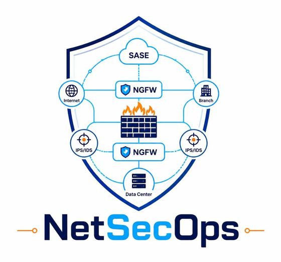

<p align="center">
  
</p>

<p align="center">
  <em>Read-only configuration &amp; vulnerability assessment for network and security infrastructure</em>
</p>

<p align="center">
  
  
  
  
  
  
  
</p>

---

## Overview

NetSecOps is a self-hosted, web-based platform that assesses the configuration and
vulnerability posture of network and security devices — Cisco, Palo Alto Networks,
Fortinet and Check Point — and tracks how that posture changes over time.

It authenticates to devices over SSH and vendor HTTPS APIs, extracts running
configuration and operational state, normalises it into a vendor-neutral model, and
evaluates it against a library of hardening, firewall-hygiene, AAA and crypto checks,
correlating software versions against CVE and vendor PSIRT advisories.

### NetSecOps never changes a target device

This is a hard constraint, not a policy setting ([SRS §8](docs/SRS.md)):

- **Allow-list, not deny-list.** Every vendor adapter declares the exact set of commands
  and API operations it may issue. Anything else is rejected *before transmission*.
- **Defence in depth.** A global deny-list additionally blocks write verbs
  (`configure`, `write`, `copy`, `reload`, `set`, `commit`, …) even if an allow-list
  entry were mis-specified.
- **GET-only REST.** POST is permitted solely for authentication and for vendor APIs
  that are POST-only by design (Check Point `show-*`, FortiManager `method: "get"`).
- **No side effects.** Adapters never run `ping`, `test aaa`, `debug`, or anything that
  writes a file or sends a packet from the device.
- **No unchecked path.** Adapters hold a guarded session, not a transport. An adapter
  author cannot forget to check, because there is nothing unchecked to reach for.
- **Proven in CI.** 283 conformance assertions check what the guard *decides*, and a
  fake SSH device that records every byte it receives checks what actually *arrives*.
  The build fails on either.
- **Transparent.** Every command sent to a device is recorded in a tamper-evident audit
  log, so customers can see exactly what ran.

---

## Status — Phases 0–6 and 8 complete, 7 under way

Development follows the phase plan in [SRS §12](docs/SRS.md). Phases 0–5 were built
strictly in order, each one's acceptance criteria passing before the next began.

Phases 6, 7 and 8 were opened at the same time, which is a deliberate departure from that
rule and is [recorded in SRS §12](docs/SRS.md) rather than left implicit. Phases 6 and 8
have since met their acceptance criteria. Phase 7 has not, and the section below says
exactly which part is missing — a phase that is 80% done is far easier to misread as
finished than one that has not started.

Phase 8 was not in the SRS as issued. It was added after a competitive analysis found
that multi-device reasoning — "can this host reach that one, and what decides" — is the
one capability separating this product from the established tools in its category, and
that most of the other gaps identified collapse into it.

| Phase | Scope | Status |
|:-----:|-------|--------|
| **0** | Monorepo, auth/MFA/RBAC, credential vault, audit chain, CI, Docker | **Complete** |
| **1** | Inventory, credentials, job engine, read-only enforcement framework | **Complete** |
| **2** | Cisco IOS/IOS-XE/NX-OS/ASA collection, parsing, drift | **Complete** |
| **3** | Check engine + baseline library, findings, compliance mapping | **Complete** |
| **4** | Palo Alto, Fortinet, Check Point + firewall rulebase analysis | **Complete** |
| **5** | Wireless (WLC/9800) + AAA: ISE, FortiAuthenticator, FreeRADIUS, tac_plus | **Complete** |
| **6** | Vulnerability assessment: NVD, CSAF, PSIRT, EoL, KEV/EPSS | **Complete** — acceptance met |
| 7 | Discovery, reporting, integrations, hardening | **In progress** — SIEM forwarding built; notifications and SNMP discovery outstanding |
| **8** | Topology and path analysis | **Complete** — acceptance met |

Thirteen platforms are collected and parsed, and the check library stands at 103.

### Phase 6 — what it does

Vulnerability assessment **produces findings now**. A device is assessed against
ingested advisories and end-of-life data, and the result is a finding on that device
with its own lifecycle, visible in the console at `/vulnerabilities`.

The parts that shape the answer:

- **Four outcomes, not two.** The matcher returns *confirmed*, *likely*, *not affected*
  or **not evaluated**, and the last is the default. A finding opens on confirmed or
  likely and is resolved only by a *positive* not-affected; not-evaluated leaves it
  open. Clearing a device requires evidence, never the absence of it.
- **Only a fully-understood advisory can clear a device.** An advisory whose version
  ranges were partly unparseable can rule a device *in* and never *out*, which is why
  CSAF ingestion keeps what it cannot read instead of dropping or guessing it.
- **Offline bundle import, hash-verified.** `POST /vulnerabilities/feeds/import` takes
  NVD 2.0 JSON, CSAF 2.0, endoflife.date, CISA KEV and FIRST EPSS bundles — the last as
  gzipped CSV, which is what FIRST actually publishes. SHA-256 is checked before anything
  is written, and every attempt is recorded including the failures.
- **KEV is prioritisation you can act on.** *Is this being exploited right now* outranks
  every severity score: a CVSS 9.8 nobody has ever attacked and a 7.5 in active
  ransomware use are not the same work item. Importing the catalogue writes `False` onto
  every CVE it does *not* list, which is the whole difference between three states and
  two — set only the listed ones and everything else still reads "never checked", so the
  filter still matches nothing.
- **The catalogue is stored whole, not reduced to a flag.** Otherwise the answer depends
  on import order: load the catalogue, then an advisory bundle introducing a new CVE, and
  that CVE reads "never checked" while an entry for it sits in the same database. With
  the catalogue present the flag is derivable whenever a CVE arrives, either way round.
- **EPSS scores what is known and leaves the rest null.** A CVE the feed does not mention
  is *unscored*; writing zero would say "almost certainly not exploited", which for
  anything too new to have been modelled is exactly backwards.

The parts added last, each of which changes what an answer means:

- **Scheduled sync is built** (FR-VUL-07). `POST /vulnerabilities/feeds/sync` queues a
  job, and the scheduler fires one nightly. Three design points carry it. The online
  route **reuses the offline importer wholesale** rather than growing its own ingest —
  otherwise the code air-gapped customers depend on is not the code anyone exercises
  daily, and only the run's recorded `mode` distinguishes them. NVD is fetched
  **incrementally** by last-modified date, because a CVE whose score or affected ranges
  were revised is exactly when a device's status changes without the device changing, and
  a "new CVEs only" design misses it. And **offline mode refuses out loud**: a scheduled
  sync that appears configured, never runs and reports no error is the
  stale-feed-that-looks-current failure this whole subsystem exists to prevent.

  A gap wider than NVD will answer — it caps a query at 120 days — comes back **partial
  with the uncovered stretch named**, not succeeded. A sync claiming currency over three
  months it never asked about is the same confident-wrong answer in a smaller box.

  Vendor PSIRT feeds are not fetched: Cisco's openVuln API needs an OAuth client
  credential and the others publish CSAF at per-advisory URLs that must be walked from an
  index. Both already have a working offline path.
- **CPE product names are checked, against evidence rather than a dictionary.**
  `GET /vulnerabilities/cpe-coverage` compares the platform-to-CPE table against the CPE
  strings imported advisories actually use — no NVD dictionary needed, because every
  advisory carries NVD's own spelling. A name is *corroborated*, *contradicted* (the same
  name under different punctuation appears instead — `nx-os` against NVD's `nx_os`), or
  *no evidence*. Deliberately not string similarity: `ios_xe` and `ios_xr` are 0.8
  similar and are different operating systems. Against the repository's fixtures: 2
  corroborated, 0 contradicted, 11 unconfirmed for want of advisories.
- **The upgrade-path view is built** (FR-VUL-10).
  `GET /vulnerabilities/devices/{id}/upgrade-path` ranks every release the device's own
  advisories name as fixed by what each would close, KEV first — a release ending one
  vulnerability under active exploitation beats one ending nine nobody has attacked.

  Candidates are never synthesised. Suggesting "try 17.9.5" because 17.9.4 is fixed would
  recommend a release that may not exist, and an engineer who schedules an outage for it
  does not get a second one.

  Each CVE comes back eliminated, remaining or **undetermined**, and the third is never
  folded into the others: `15.2(7)E3` and `15.2(4)M5` are parallel trains with
  independent fix schedules, and neither is later than the other. Calling such a CVE
  fixed is dangerous; calling it still-open is safer and still wrong, because it makes a
  good upgrade look worse and steers the engineer toward a release that closes less.

  A CVE is only eliminated when *every* advisory naming it is closed. One flaw routinely
  appears in several — a vendor re-issues, or it affects two components with different
  fix trains — and an earlier version of this credited a release with a fix it only
  partly delivered.

#### The foundations underneath

- **Versions that are not a total order.** `packaging.Version` and every semver library
  assume any two versions can be ranked. Cisco IOS breaks that: `15.2(7)E3` and
  `15.2(4)M5` are parallel trains with independent fix schedules and neither is later.
  Forcing an order there is not approximately right — it reports a patched device as
  exploitable, or an exploitable one as patched, depending which way the comparison
  falls. `compare()` returns "not ordered" as a third answer, and `DeviceVersion` has no
  `__lt__`, because `<` cannot express it.
- **Operational state reaches the parsers.** Version, model and serial are not in a
  running configuration on most platforms; they come from `show version` and friends,
  which the collection runner used to store as an artefact and then discard. Supporting
  artefacts are now carried beside the configuration — never inside it, because
  `show version` reports an uptime that would make every device drift on every poll.
- **CPE 2.3 identifiers, with two refusals.** No CPE without a version, because a
  wildcard matches every advisory ever written for the product. No CPE for an unmapped
  product, because a guessed name matches nothing while looking like a clean result.
  The product names are provisional until checked against a real NVD dictionary —
  `unverified_products()` exists for exactly that, and until it runs any wrong name is a
  device silently reporting zero vulnerabilities.
- **CSAF 2.0 ingestion that keeps what it cannot read.** A prose version range or a
  product id the document never defines is recorded as *unparsed* with the vendor's own
  text, not dropped and not guessed. Dropping it hides a real vulnerability; guessing
  flags every device running the product. An advisory that is only partly understood can
  rule a device *in*, never *out*.

### Phase 7 — what it does, and what is still owed

**Reporting is built, and reports are dated artefacts rather than saved queries.** A
report's content is assembled once, hashed, and never recomputed: re-reading March's
report in September returns March's numbers, including findings that have since been
fixed. That is what lets it answer "what did you know on 31 March", which no live view
can. All nine catalogued templates assemble, in four formats — JSON, CSV, XLSX and PDF —
and every format of one report carries the same content hash, because they render the
same frozen content. A template with no single table is refused for CSV and XLSX rather
than emitting a blank grid that reads as "no findings".

**Discovery probes, and every run is paced.** Scopes, the FR-DISC-02 probe allow-list,
fingerprinting with confidence scoring and the pending-review queue were built first and
had nothing driving them; FR-DISC-05 supplies the rest. A run is a job: it is queued,
cancellable between batches, and recorded as a `discovery_runs` row that outlives the
job history. Four of the five permitted probes are sent — ICMP echo, TCP connect to the
scope's ports, an SSH banner read and an HTTPS certificate-and-header fetch.

The rate limit is the reason this could ship at all. An unpaced run across a scope is
the port sweep [SRS §1.2](docs/SRS.md) forbids, whatever the allow-list says about the
individual packets, so the prober *holds* the limiter and there is no code path from the
endpoint to a socket that skips it. The default is FR-DISC-05's 50 hosts a second,
configurable per scope up to a ceiling — "configurable" with no ceiling would make the
requirement unenforceable.

Two things a run cannot do are recorded on the run itself rather than left to look like
a quiet network. **SNMP is not read**: FR-DISC-02 permits it, but no SNMP credential can
be stored against a scope yet, and sysObjectID is the heaviest fingerprint signal there
is — so hosts score lower and more of them need a person. **ICMP needs `CAP_NET_RAW`**,
which containers withhold by default; without it liveness falls back to TCP and a device
with no open port on the list is missed. Both appear beside the counters in the console,
because "0 hosts found" and "0 hosts found, and nothing could be asked" are different
answers.

**Scheduling is built** (FR-JOB-02, and FR-DISC-05's second half). `netsecops-cli
scheduler` is a separate process that fires due schedules and enqueues them through the
same path the API uses, so a scheduled collection and a manual one are the same job. Four
behaviours are where the obvious implementation is the wrong one: a scheduler down for a
day fires each schedule **once**, not once per missed occurrence; a blackout window
**skips** rather than defers, because deferring stacks every skipped schedule onto one
minute; two schedulers never fire the same schedule (`FOR UPDATE SKIP LOCKED`); and a
schedule with no possible slot is **disabled with a reason** rather than silently never
running. Cron is read in the schedule's own time zone — `0 2 * * *` in `Asia/Kolkata` is
not 02:00 UTC.

**SIEM forwarding is built** (FR-INT-02). Findings and audit records go to a collector as
RFC 5424 syslog over TLS, in CEF or JSON. It is batch-and-watermark rather than
send-on-write: emitting from every write path would put a network call inside the
transaction that created the finding, so a dead collector would slow or fail the
assessment that found it — inverting the priority, since the assessment is the product
and the forwarding is a copy.

The two streams have different hazards. Audit records carry a monotonic id, so the
watermark is exact. Findings are UUID-keyed, so theirs is a timestamp — and a row whose
`created_at` is T can commit *after* a batch already advanced past T, and would then never
be sent, with nothing anywhere looking wrong. The finding stream therefore stays thirty
seconds behind the present, trading a little latency for not losing events silently. A
failed send does not advance either watermark, so a collector outage delays delivery
rather than dropping it.

Two details that are easy to get backwards and invisible when you do. Syslog severity runs
0 (emergency) to 7 (debug) — *inverted* relative to CEF's 0–10 — so a table written by
analogy sends critical events as `debug`, where the first relay filtering on severity
drops them while the integration looks healthy. And TLS framing is octet-counted, not
newline-delimited, because a JSON body can legally contain a newline and framing on one
splits records into fragments the collector cannot parse while the transport reports every
byte delivered.

Nothing leaves unscrubbed: findings quote configuration, and configuration carries
community strings and pre-shared keys, so the redaction that protects the database
protects the wire too.

Still owed: **notifications** (FR-INT-01) — e-mail, webhooks and Slack/Teams are not
started, and FR-RPT-04's scheduled report *delivery* waits on the mail transport there,
though scheduled report *generation* works today. **ServiceNow/Jira** (FR-INT-03,
priority S) is not started. **SNMP discovery**, which needs credential storage on a scope.
FR-INT-04, the RBAC'd REST API with OpenAPI, was already in place.

#### What is built

- **A discovery probe allow-list.** SRS §1.2 rules out port sweeps, exploitation and
  brute-forcing; FR-DISC-02 names the five things discovery may do instead. That set is
  closed and asserted, because the way it erodes is not a bug but a drift — one more
  port for a customer running SSH on 2222, a slightly longer banner read, a second OID,
  each defensible alone and a port scanner in sum. A scope may name at most eight TCP
  ports, since "configurable list" otherwise permits a sweep assembled entirely from
  permitted probes. SNMP is refused outright without a configured credential: probing
  anyway means trying `public`, which is a credential guess. No scope can supply one
  yet, so in practice the executor sends the other four probes and says so on the run.
- **Scopes that refuse a mistyped prefix.** `10.0.0.0/8` is one character from
  `10.0.0.0/18` and sixteen million probes from what the operator meant. The ceiling is
  counted from network sizes without expanding anything, exclusions are *subtracted*
  from the address space rather than filtered at probe time — so an excluded host is
  never enumerated at all — and the refusal names the likely cause, because an operator
  who reads only "over the limit" raises the limit.
- **Fingerprinting that scores what it could not tell apart.** Signals are weighted by
  how much they actually prove — an SNMP sysObjectID far above an HTTP header — and
  confidence is capped below certainty, because no banner is proof. Conflicting signals
  subtract. The review queue then opens with the *lowest* confidence first, which looks
  backwards until you remember what the queue is for: a low score means the
  fingerprinter could not tell, and those are the entries that need a person.
- **A review queue that onboards nothing by itself.** An approval carries the operator's
  corrections, a rejection carries a note, and neither deletes anything.
- **A paced run executor (FR-DISC-05).** The limiter's unit is hosts, because the
  requirement's unit is hosts: one slot is taken when a host's probing begins, and that
  host's probes then run in sequence, so the packet rate stays proportional instead of
  multiplying by the port count. Concurrency is separate from the rate and answers a
  different question — how many hosts may be in flight while the slow ones time out —
  without which a scope of mostly-dead addresses runs at one host per timeout and the
  rate limit never binds at all. A cancel is honoured between batches, and the run keeps
  what it had already found rather than discarding it.
- **Managers as an inventory source (FR-DISC-06).** Panorama, FortiManager and Check
  Point management enumerate their children. Preview and import are separate calls,
  children land in pending review rather than the inventory, and nothing is ever
  auto-deleted — a child that disappears from a manager may be a decommission or may be
  an API error, and the two must not be treated alike.
- **Reports as dated artefacts.** Described above; the model and the freezing property
  live in `db/models/reporting.py` and `services/reporting.py`.

### Phase 8 — what it does, and what is still owed

**Forwarding tables are data now, and they were not before.** The NCM kept
`static_routes` as an integer — a *count* — so the product could describe every rule on a
firewall and had no idea which firewall a packet reached first. Each parser now reads its
own platform's route grammar into a real list of destination, next hop, egress interface,
protocol, distance, metric and VRF, and derives connected routes from interface
addressing.

**No new device access was needed for any of it.** Static routes are in the running
configuration, which was already collected and already parsed — the lines were being
counted and thrown away, and on the ASA they sat on an explicit ignore list as noise.
That is also how the commercial tools build their maps: no probing, no traceroute, no
CDP/LLDP walk, no agents. [SRS §8](docs/SRS.md)'s read-only guarantee is untouched.

**What a protocol learned is now collected too**, which it was not at first. OSPF, BGP and
EIGRP routes exist in no configuration file on any platform — they live only in the
forwarding table — so the first version of this was static-and-connected only: complete
for an edge or DMZ estate, partial in a routed core. Closing that needed `show ip route`
(IOS), `show ip route vrf all` (NX-OS) and `show route` (ASA) added to the read-only
allow-list, which is a change to what the product sends to a device and so was made
deliberately and [recorded in SRS §8.2](docs/SRS.md) rather than slipped in. FortiOS
already collected its table and nothing read it.

Every route still records the protocol that installed it, because the graph has to be able
to say how complete it is rather than implying completeness. Three formats are parsed:
IOS/ASA/FortiOS print a leading protocol code and a prefix, NX-OS prints a prefix line with
indented `*via` lines and names protocols in words. Each has a way of failing silently —
IOS prints subnetted children *without* a prefix length, so reading one literally gives a
/32 host route to a network address that matches nothing; equal-cost paths arrive as
continuation lines carrying no destination of their own; NX-OS ends its lines with the
protocol and route type, so a reader working backwards adopts `direct` or a BGP tag as an
interface name. All three are fixture-tested, and the operational table supersedes the
configuration's statics rather than adding to them, since the device's own table already
contains them.

**A path can now be traced across devices, and the answer has two axes.** Give it a
source, a destination, a protocol and a port, and it finds the devices in between and asks
each of their rulebases — the FR-FW-06 rule query, run once per hop. Devices are joined by
*interface address*: a route's next hop either is an address configured on another
inventoried device or it is not, and matching on subnet instead would invent adjacencies
on any shared transit link.

The two axes are the point, and they never collapse into one verdict:

> Every firewall I found permits this, but I lost the path at `0.0.0.0/0` because
> `203.0.113.1` belongs to no device in the inventory.

That is `routing: partially-routed`, `policy: partially-allowed` — and `allowed` is only
ever produced alongside `routed`. A permit speaks for the devices actually consulted, and
an untraced remainder may hold another firewall; somebody opens a firewall on the strength
of these answers. A block is the asymmetric case and stands on its own: the packet dies at
the first denial, so what lies beyond it cannot change the result.

Three other distinctions the model keeps that a simpler one would lose. A router with no
rulebase reports **no decision** rather than "allow", because a device that inspected
nothing is not a control that was checked. A route in a VRF is never followed as if it
were global — which VRF a packet is in depends on the ingress interface, and no parser
records that binding, so the answer is `unknown` naming the VRF rather than `unreachable`.
And a device whose snapshot predates route parsing, or whose table was truncated, cannot
produce a negative answer at all.

**The ranked missing-device report** names the unmanaged next hops that terminate path
analysis, ordered by how much reachability each conceals — a default route counts for far
more than one specific prefix, and a next hop nine devices share counts for more than one.
It is computed from the routes themselves rather than by running every path, which is
quadratic in the estate and measures the queries somebody happened to ask instead of the
gap itself. The addresses are evidence, not a work queue: an unmanaged next hop may be an
ISP router, a customer handoff, or a virtual address no single box owns.

**The acceptance criterion is met** ([`test_phase8_acceptance.py`](backend/tests/test_phase8_acceptance.py)):
a five-device fixture estate, a path query crossing three of them with the right
traversed-device list and rule verdicts, and a query whose next hop belongs to no
inventoried device naming that next hop instead of reporting it unreachable.

Writing it surfaced a contradiction in the specification. FR-TOPO-04 defines
`partially-routed` as its own routing value; FR-TOPO-05 says the leaves-the-estate case is
`unknown`. Both cannot hold — if that case were `unknown`, `partially-routed` would have
nothing to describe. It is resolved in favour of the more precise value and
[recorded in SRS §3.8a](docs/SRS.md): a path that leaves the estate at a named, real next
hop is `partially-routed`, and `unknown` is kept for what genuinely could not be determined
— a table never collected, a truncated one, a routing loop, a VRF binding nothing records.
The difference is operational: the first is fixed by onboarding a device the report already
ranks, the second by re-collecting one.

Still owed, and deliberately: IOS per-VRF tables. `show ip route vrf <name>` needs the VRF
list first and a round trip per VRF, where NX-OS returns every table in one response — so
IOS collects the global table only, and a path that depends on an IOS VRF resolves to
`unknown` naming the VRF rather than guessing.

### What Phase 5 delivers

- **Wireless from three controllers into one vocabulary** — Cisco WLC AireOS, Catalyst
  9800 and FortiGate. AireOS is a command list rather than a configuration file and the
  other two are hierarchical, but an SSID accepting WPA2-PSK is the same finding on all
  three, so the security posture normalises even where the syntax cannot.
- **AAA servers as first-class targets** — Cisco ISE and FortiAuthenticator over their
  REST APIs, FreeRADIUS and tac_plus by reading their configuration files over SSH.
  These fill `aaa_server` rather than `aaa`: they are the service the estate
  authenticates *against*, not a consumer of it.
- **Cross-estate correlation** (FR-AAA-05) — every device's configured AAA servers
  against the servers in inventory, and every server's client list against the devices
  in inventory. The highest-value output is the second direction: a switch configured on
  ISE but absent from inventory is a device assessed by nothing, and a clean compliance
  percentage measured over an estate that does not contain it.
- **Three conclusions it refuses to draw.** With no AAA server collected, every device
  trivially appears on no client list — reported as the absence of the question, never as
  "every device is unregistered". ISE and FortiAuthenticator mask shared secrets, so
  reuse is *unknown* for their clients rather than absent. Coverage over an estate
  nothing was collected from is `null`, never 0%.
- **An AAA posture dashboard** (FR-AAA-06) — coverage, accepted protocols, orphaned
  clients and a certificate expiry timeline, each panel stating where it is blind. The
  protocols panel is titled "accepted", not "in use", because nothing here observes a
  live authentication. A certificate whose expiry could not be read is listed as undated
  rather than dropped: an unreadable date is not a distant one.
- **13 wireless and AAA checks**, and an audit that every check expression resolves
  against real parser output — a check naming an NCM path no parser populates is not a
  dead check but a false finding on every device, forever.
- **The Phase 5 acceptance criterion, as a test.** Nine devices built from the shipped
  fixtures through the shipped parsers, with every expected number read off the fixtures
  by hand rather than off a run of the code
  ([`test_phase5_acceptance.py`](backend/tests/test_phase5_acceptance.py)).

### What Phase 4 delivers

- **Three more vendors** — PAN-OS, FortiOS and Check Point. Check Point splits in two:
  the policy lives on the management server and the gateway holds only Gaia, and neither
  can answer the other's questions, so they are separate platforms rather than one
  parser guessing which it was handed.
- **Rulebase normalisation** — PAN-OS security rules, FortiOS policies and Check Point
  access layers become one ordered rule model, with objects and groups resolved so that
  analysis compares addresses rather than names.
- **Relationship analysis** (FR-FW-03) — shadowing, redundancy, correlation and
  generalisation between rules, plus the hygiene findings that matter in practice:
  any–any rules, rules that log nothing, rules with no security profile, and unused
  objects. Rule negation is handled rather than ignored, since a negated source inverts
  the meaning of every comparison downstream.
- **NAT analysis** (FR-FW-04) and **manager child enumeration** — Panorama, FortiManager
  and Check Point SMS, behind an approval gate, because discovering devices through a
  manager adds targets that nobody explicitly onboarded.
- **A rulebase viewer** (FR-FW-06, FR-FW-07) with rule query and CSV export, so a
  finding about rule 1,847 can be looked at rather than taken on trust.
- **5,000 rules analysed in 2.7s against a two-minute budget** (NFR-PERF-03) — 8.7M rule
  pairs considered, 9,453 fully compared. The rulebase is shaped like a real one,
  overlapping /24s drawn from a shared object pool rather than a corpus where nothing
  intersects and only the prefilter is exercised. A deliberately adversarial rulebase
  where almost every pair overlaps still completes in 38s.

### What Phase 3 delivers

- **A check engine, and three rules it never breaks.** Checks are YAML — id, severity,
  applicability, JMESPath logic over the NCM, remediation, framework mapping. A field
  the parser never found yields *Not Evaluated* and names the missing path, never a
  verdict derived from its absence. An empty list is a real answer. A broken check is
  an *Error* against that check alone, so one bad file cannot cost an assessment.
- **66 checks, all applicable to Cisco IOS** — 47 declarative, 14 Python for logic YAML
  cannot honestly express, 5 regex. Against the fixture corpus the hardened switch
  scores 56 pass / 1 high-severity fail and the weak one 41 fails; the ASA reports 39
  *Not Applicable* rather than passing switch checks it was never subject to.
- **Remediation is text, and only text.** There is no field in the schema that could be
  executed, and a test asserts none appears (SRS §8).
- **Policies** grouping checks, assignable to device groups, with per-check severity
  overrides — the customisation that matters, because severity is contextual in a way a
  shipped library cannot know. The CIS Cisco IOS L1 pack ships with 44 checks and is
  installed idempotently, then never overwritten.
- **Custom checks** written through the API against the same schema the loader uses —
  and refused if they declare Python logic, since accepting a function name from a web
  form would let a user invoke any registered callable.
- **Exceptions with a mandatory expiry.** The check still runs and its result is still
  stored; only the finding is suppressed. Hiding the result would make the compliance
  figure a fiction, and an exception without an end date is an undocumented decision.
- **Findings with a lifecycle that reflects reality.** *Resolved* is reachable only by
  the check passing on a later assessment — the API refuses to set it by hand, so the
  status stays a measurement rather than a claim. A problem that returns reopens the
  original finding instead of appearing as a first sighting.
- **A risk score that is documented and explainable.** Severity weights are widely
  spaced on purpose: under a linear scheme fourteen Low findings outrank one Critical.
  Device criticality multiplies rather than adds. *Not Evaluated* is reported as a
  separate coverage figure instead of being quietly counted as a pass.
- **Compliance pivoted by framework control**, with the percentage computed over what
  was actually decided — *Not Applicable* and *Not Evaluated* are in neither half.

### What Phase 2 delivers

- **Cisco parsers** — IOS/IOS-XE, NX-OS and ASA configurations become a vendor-neutral
  **Normalised Config Model**. Parsing is tolerant: an unrecognised stanza is kept in
  `raw_unparsed` and never fails a collection, and the percentage understood is stored
  on the snapshot so a degraded parse is visible rather than silently weakening checks.
- **Provenance on every value** — each NCM field records the artefact and line range it
  came from, so a finding can show the operator their own configuration line instead of
  asserting a conclusion.
- **Absent is not false** — a service the configuration never mentions stays `null`,
  which later reports as *Not evaluated*. Only an explicit `no ip http server` becomes
  `false`. Blurring the two produces confident, wrong findings.
- **Collection profiles** — what each platform is asked for, as data. A test asserts
  every profile command already appears in the §8.2 allow-list, so a profile can never
  widen what NetSecOps may send to a device.
- **Redaction before storage** — secrets are replaced with fingerprinted placeholders on
  every path that leaves the server. The unredacted original exists in one place, sealed,
  reachable by one endpoint that needs `config:view_unredacted` and writes an audit
  record before it answers.
- **Snapshots and drift** — identical configurations de-duplicate to one row, ignoring
  volatile lines like NVRAM timestamps and `ntp clock-period`. Pin a snapshot as the
  baseline and later collections that differ raise a drift finding with the diff
  attached, severity raised for security-relevant changes.
- **Diff, two ways** — a unified and side-by-side text diff, plus a semantic diff over
  the NCM that says *"management.services.telnet.enabled changed disabled → enabled"*
  rather than leaving an operator to derive it from ±40 lines.
- **Offline configuration upload** — assess an air-gapped or pre-onboarding device from
  an exported configuration file, through the same storage, parsing and drift path as a
  live collection.

### What Phase 1 delivers

- **Read-only enforcement** — the four-layer guard described above, 19 platform
  policies, and `netsecops-cli audit-commands` to print them for review.
- **Device sessions** — adapters hold a guarded session, never a transport, so there is
  no unchecked path to a device. SSH with host-key pin-on-first-use, jump hosts and
  per-device timeouts.
- **Inventory** — devices, hierarchical Device Groups (ltree), sites, tags, and CSV
  import with a dry-run preview that reports the offending line before anything is
  written.
- **Credential vault** — typed credentials whose secret fields are sealed and whose
  unknown fields are rejected, so a password cannot land in searchable metadata.
  Device assignments override inherited group ones, and group credentials are inherited
  down the hierarchy.
- **Job engine** — scope resolution, per-device outcomes with FR-COL-07 error classes,
  credential fallback, graceful cancel, re-run-failed, idempotency keys, and a
  WebSocket progress stream.
- **Scope enforcement** — Device Group visibility applied in the query, not by the
  caller, so a group-scoped user cannot widen their reach.

### What Phase 0 delivers

- **Authentication** — Argon2id password hashing, a configurable password policy with
  a no-reuse history window, and account lockout after repeated failures.
- **Sessions** — short-lived access tokens (≤15 min) and rotating, revocable refresh
  tokens (≤8 h), delivered as `Secure; HttpOnly; SameSite=Strict` cookies. Replaying a
  rotated refresh token revokes the whole session family and raises an audit event.
- **MFA** — RFC 6238 TOTP with single-use recovery codes; codes cannot be replayed
  inside their validity window.
- **RBAC** — the five roles from SRS §2.3 over a single permission vocabulary, with
  object-level Device Group scoping for the group-restricted roles. Endpoints declare
  a *permission*, never a role list.
- **Credential vault** — AES-256-GCM envelope encryption with per-record data keys
  wrapped by a pluggable master key, bound to the owning row so a ciphertext cannot be
  replayed into another record. Master-key rotation re-wraps without re-encrypting.
- **Audit log** — append-only and hash-chained, enforced *both* by chain verification
  and by database triggers that reject UPDATE, DELETE and TRUNCATE outright.
- **Secret scrubbing** — one central processor redacts secrets from every log line and
  audit record, including device-config idioms like `snmp-server community X`.
- **Quality gates** — `ruff`, `mypy --strict`, `pytest`, `bandit`, `pip-audit`,
  `eslint`, `tsc`, `vitest`, Trivy and Gitleaks, all wired into CI.

---

## Quick start

**Requirements:** Docker 24+ and Docker Compose. Nothing else.

```bash
git clone https://github.com/Krishcalin/NetSecOps.git
cd NetSecOps

make up              # generates keys, builds, migrates, prints the URL
make create-admin    # create the first Super Admin
```

Then open <http://localhost:8080>.

> **Back up `MASTER_KEY` separately from the database.** It wraps every stored device
> credential. Losing it means losing them all; storing it beside a database dump means
> a single stolen backup yields both.

**Port already in use?** Every published port is overridable in `.env`, which matters on
a workstation running several projects:

```bash
UI_PORT=8088     # SPA           (default 8080)
API_PORT=8010    # API           (default 8000)
DB_PORT=5442     # PostgreSQL    (default 5442, chosen to avoid a local 5432)
```

### Running without Docker

```bash
make install         # backend venv + frontend node_modules
make db              # just PostgreSQL, on host port 5442
make migrate
make dev-api         # http://localhost:8000
make dev-ui          # http://localhost:5173
```

---

## Repository layout

```
netsecops/
├─ backend/
│  ├─ netsecops/
│  │  ├─ adapters/     # read-only guard, platform policies, sessions, transports
│  │  ├─ api/          # FastAPI routers, dependencies, middleware
│  │  ├─ core/         # config, logging, crypto, security, RBAC, errors
│  │  ├─ db/           # declarative base, session, models, Alembic migrations
│  │  ├─ checks/       # the check engine, its YAML library and policy packs
│  │  ├─ discovery/    # probe allow-list, scopes, fingerprinting, pacing, the
│  │  │                #   probe transport and the run executor (Phase 7)
│  │  ├─ topology/     # the layer-3 graph, the path walk and the ranked
│  │  │                #   missing-device report (Phase 8)
│  │  ├─ firewall/     # rulebase model, relationship analysis, NAT, hygiene
│  │  ├─ ncm/          # the Normalised Config Model (NCM v1)
│  │  ├─ parsers/      # vendor config parsers, one package per vendor
│  │  ├─ schemas/      # Pydantic request/response models
│  │  ├─ services/     # business logic, independent of HTTP
│  │  ├─ vuln/         # versions, CPEs, advisories, feed parsing (Phase 6)
│  │  ├─ workers/      # job runner, credential probe, queue abstraction
│  │  └─ cli.py        # netsecops-cli
│  └─ tests/
│     └─ fixtures/     # anonymised configs and operational output, by platform
├─ frontend/           # Vite + React 18 + TypeScript SPA
├─ scripts/            # smoke_test.py — post-deployment verification
├─ tools/              # build_brand_assets.py — derives the served brand assets
├─ deploy/             # Dockerfiles, docker-compose, Caddy, Postgres init
└─ docs/
   ├─ brand/           # the master logo artwork, committed unmodified
   └─ ...              # SRS, ADRs, device-account guidance, deployment
```

Vendor-specific logic stays inside `adapters/`, `parsers/` and the vendor packs under
`checks/library/`; core services remain vendor-agnostic (C-6).

### The files worth reading first

| File | Why |
|---|---|
| [`adapters/readonly.py`](backend/netsecops/adapters/readonly.py) | The four-layer guard that enforces SRS §8 |
| [`adapters/policies.py`](backend/netsecops/adapters/policies.py) | Exactly what NetSecOps may send to each platform |
| [`adapters/session.py`](backend/netsecops/adapters/session.py) | Why there is no unchecked path to a device |
| [`adapters/profiles.py`](backend/netsecops/adapters/profiles.py) | What each platform is actually asked for, and why |
| [`ncm/models.py`](backend/netsecops/ncm/models.py) | The vendor-neutral model every check reads |
| [`services/snapshots.py`](backend/netsecops/services/snapshots.py) | How a change is told apart from noise |
| [`tests/test_readonly.py`](backend/tests/test_readonly.py) | 283 assertions that the guard decides correctly |
| [`tests/test_device_session.py`](backend/tests/test_device_session.py) | That nothing else reaches a real SSH server |
| [`tests/test_profiles.py`](backend/tests/test_profiles.py) | That a profile cannot widen the device-facing surface |
| [`discovery/probes.py`](backend/netsecops/discovery/probes.py) | The five things discovery may send, and why the list is closed |
| [`vuln/versions.py`](backend/netsecops/vuln/versions.py) | Why two versions are sometimes not ordered at all |
| [`checks/engine.py`](backend/netsecops/checks/engine.py) | Why a check declines to have an opinion |
| [`checks/library/`](backend/netsecops/checks/library/) | Every check, as data, with its reasoning |
| [`services/risk.py`](backend/netsecops/services/risk.py) | The risk formula, and why it is shaped that way |

---

## Development

```bash
make check       # every gate: lint, typecheck, test, security
make lint        # ruff + eslint
make typecheck   # mypy --strict + tsc
make test        # pytest + vitest
make test-cov    # backend coverage report
make security    # bandit, pip-audit, npm audit
```

Backend tests run against a real PostgreSQL instance (the schema uses JSONB, INET and
advisory locks, so a substitute engine would not test what ships). `make db` starts one;
override the target with `TEST_DATABASE_URL`.

Load tests are opt-in, because they commit real rows and take seconds rather than
milliseconds:

```bash
cd backend && ../.venv/bin/python -m pytest -m performance -s
```

They measure job-queue throughput against NFR-PERF-01 — 20 workers sustain roughly 100×
the required device-claim rate, which is the evidence behind
[ADR-001](docs/adr/ADR-001-job-queue.md).

### Conventions

- Python 3.12+, type hints everywhere, `mypy --strict` clean.
- Every schema change is an Alembic migration — no manual DDL. CI runs `alembic check`
  to catch a model that drifted from its migration.
- Every endpoint appears in the authorization matrix (`tests/test_authz_matrix.py`).
  Adding a route without an entry fails the build by design.
- All configuration via environment variables; no secrets in the repo or an image.

---

## CLI

```bash
netsecops-cli create-admin           # bootstrap the first Super Admin
netsecops-cli generate-master-key    # generate a credential-vault master key
netsecops-cli generate-secret-key    # generate a JWT signing key
netsecops-cli verify-audit-chain     # replay the hash chain, detect tampering
netsecops-cli rotate-master-key      # re-wrap every stored secret
netsecops-cli reset-password <user>  # break-glass password reset
netsecops-cli reset-mfa <user>       # break-glass: clear a lost authenticator
netsecops-cli audit-commands         # print the read-only allow-list per platform
netsecops-cli permissions            # print the role × permission matrix
netsecops-cli health-check           # database reachability + schema revision
netsecops-cli show-config            # effective configuration, secrets masked
netsecops-cli version                # build version
```

One command is not a utility but a long-running process:

```bash
netsecops-cli scheduler              # fire due schedules (FR-JOB-02)
```

It runs as its own container under the `workers` compose profile. Running two is safe —
due schedules are claimed with `FOR UPDATE SKIP LOCKED` — and running none means
schedules simply never fire, which shows in the console as a next-run time in the past.

### Locked out of MFA?

Disabling MFA through the API needs a session, and MFA is what blocks sign-in — so
recovery runs on the server:

```bash
docker compose -f deploy/docker-compose.yml exec api netsecops-cli reset-mfa admin
```

The user then signs in with their password alone and re-enrols from **Profile →
Two-factor authentication**. The reset is recorded in the audit log. Recovery codes
issued at enrolment also work as a second factor — each one once.

---

## Smoke-testing a deployment

```bash
python scripts/smoke_test.py \
    --api http://localhost:8000 --ui http://localhost:8080 \
    --admin-user admin --admin-password '...'
```

Checks the live stack across fourteen sections: unauthenticated rejection, security
headers, cookie flags, RBAC, MFA enrolment and challenge, refresh rotation, audit-chain
integrity, inventory and the SPA. It creates a throwaway user for the destructive parts
and deletes it afterwards, so it never alters the account it signs in with.

---

## Documentation

| Document | Contents |
|---|---|
| [docs/SRS.md](docs/SRS.md) | Full software requirements specification — the baseline |
| [docs/device-accounts.md](docs/device-accounts.md) | Recommended read-only accounts per platform |
| [docs/deployment.md](docs/deployment.md) | Deployment, sizing, backup and key management |
| [docs/adr/](docs/adr/) | Architecture decision records |

The API documents itself: OpenAPI at `/api/v1/openapi.json`, interactive docs at
`/api/v1/docs` outside production.

---

## Licence

MIT — see [LICENSE](LICENSE).
